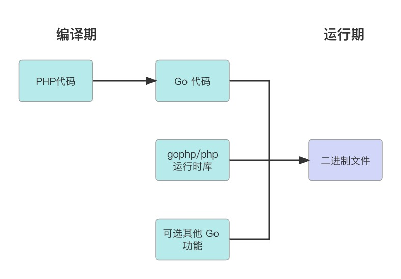
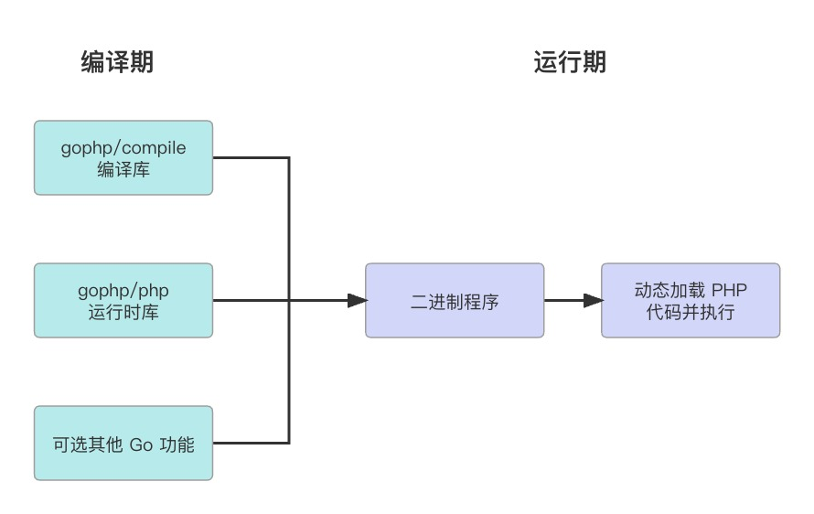

# 设计

## 目录结构

- `php` 核心目录，定义基础类型、运行时等
    - `token`  : PHP 词法相关定义
    - `ast`    : PHP 语法树(AST)相关定义
    - `parser` : PHP解析器，将 PHP 源代码转成 AST 语法树
    - `printer`: AST Printer，将 AST 转为人类易读文本
- `compile` PHP 编译相关功能
    - `ir`     : 中间代码(IR)相关定义
    - `render` : 将 IR 生成为 go 代码
- `shim` 模拟新版本 API
    - `builtin` : 模拟新版本内置函数，建议 `import . "gophp/shim/builtin"` 使用
    - `cmp`     : `go1.21` 新包，比较类型
    - `slices`  : `go1.21` 新包，slice 相关泛型方法
    - `maps`    : `go1.21` 新包，map 相关泛型方法

## 流程图

两种运行模式:
1. 编译阶段，将 PHP 代码编译成 GO 代码并一起编译；运行阶段。

2. 编译阶段，引入编译相关包；运行阶段，动态加载 PHP 代码为对应内存结构并执行。

两种模式事实上可以并存。只是用第一种模式可以使用更多有效的优化项。

## 未支持特性

- `declare`: declare只支持 strict_types 指令，不支持其他指定(如 ticks、encoding)